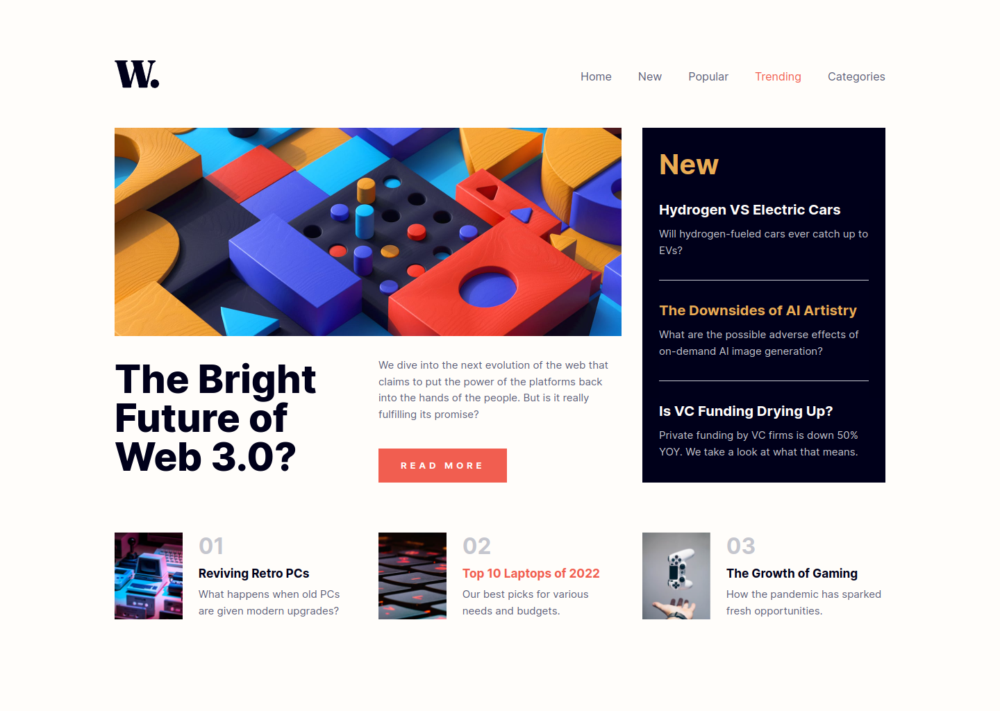

# Frontend Mentor - News homepage solution

This is a solution to the [News homepage challenge on Frontend Mentor](https://www.frontendmentor.io/challenges/news-homepage-H6SWTa1MFl). Frontend Mentor challenges help you improve your coding skills by building realistic projects.

## Table of contents

- [Overview](#overview)
  - [The challenge](#the-challenge)
  - [Screenshot](#screenshot)
  - [Links](#links)
- [My process](#my-process)
  - [Built with](#built-with)
- [Author](#author)

## Overview

### The challenge

Users should be able to:

- View the optimal layout for the interface depending on their device's screen size
- See hover and focus states for all interactive elements on the page
- Toggle the mobile menu

### Screenshot

### Links

- Solution URL: [GitHub repo](https://github.com/pnarck/FrontendMentor/tree/main/news-homepage-main)
- Live Site URL: [Netlify](https://flourishing-brigadeiros-501af9.netlify.app/)

## My process

### Built with

- [Astro](https://astro.build/) - Build faster websites

## Author

- Frontend Mentor - [Prasad Narkhede](https://www.frontendmentor.io/profile/pnarck)
